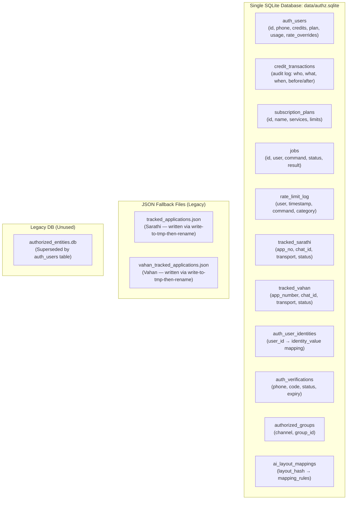

# Data Integrity Hardening — Complete Implementation Plan

**Project**: `e:\codex\sarathiwa_bot` (branch: `test-scaling`)
**Goal**: Eliminate all data loss, corruption, and race condition risks in user credits, plans, tracking, jobs, and usage data.

> [!IMPORTANT]
> **PostgreSQL is NOT needed.** SQLite with WAL mode is the correct choice for this scale (~10-50 users, <5 writes/sec, single Docker container). The problems are in HOW SQLite is used, not WHICH database is used. This plan fixes the usage patterns.

---

## Architecture Overview



---

## Summary of All 12 Vulnerabilities Found

| # | Vulnerability | Severity | File(s) | Risk |
|---|--------------|----------|---------|------|
| 1 | Credit operations not wrapped in transactions | 🔴 CRITICAL | [authorizationRepository.js:143-173](file:///e:/codex/sarathiwa_bot/src/services/authorizationRepository.js#L143-L173) | Concurrent jobs can corrupt credit balances |
| 2 | Tracking store DELETE-all + re-INSERT pattern | 🔴 CRITICAL | [autoTrackStore.js:138-149](file:///e:/codex/sarathiwa_bot/src/services/autoTrackStore.js#L138-L149), [vahanTrackStore.js:140-152](file:///e:/codex/sarathiwa_bot/src/services/vahanTrackStore.js#L140-L152) | Crash mid-write loses ALL tracked apps |
| 3 | Zero database backup mechanism | 🔴 CRITICAL | None exists | Single point of failure for all data |
| 4 | No `db.close()` on shutdown, no WAL checkpoint | 🔴 CRITICAL | [server.js:44-59](file:///e:/codex/sarathiwa_bot/server.js#L44-L59) | Recent writes can be lost on Docker restart |
| 5 | DB init via `execSync` child process | 🟠 HIGH | [authorizationRepository.js:13-14](file:///e:/codex/sarathiwa_bot/src/services/authorizationRepository.js#L13-L14) | Dual connections, WAL lock conflicts |
| 6 | Silent error swallowing everywhere | 🟠 HIGH | Multiple (see details below) | Failures go unnoticed, data silently lost |
| 7 | `INSERT OR REPLACE` can destroy user data | 🟠 HIGH | [authorizationRepository.js:61](file:///e:/codex/sarathiwa_bot/src/services/authorizationRepository.js#L61) | Race condition can wipe user's credits |
| 8 | Plan deletion without user impact check | 🟠 HIGH | [planRepository.js:46-48](file:///e:/codex/sarathiwa_bot/src/services/planRepository.js#L46-L48) | Users left with non-existent plan reference |
| 9 | Job re-queue can cause duplicate portal actions | 🟡 MODERATE | [jobQueue.js:111-133](file:///e:/codex/sarathiwa_bot/src/core/jobQueue.js#L111-L133) | Duplicate form submissions on government sites |
| 10 | No foreign key constraints | 🟡 MODERATE | [authzHelper.js:22-77](file:///e:/codex/sarathiwa_bot/src/services/authzHelper.js#L22-L77) | Orphaned records possible |
| 11 | Two separate SQLite DB files | 🟡 MODERATE | [sqliteHelper.js](file:///e:/codex/sarathiwa_bot/src/services/sqliteHelper.js) | Confusing, wastes resources |
| 12 | Docker volume config not robust | 🟡 MODERATE | [docker-compose.yml:100-102](file:///e:/codex/sarathiwa_bot/docker-compose.yml#L100-L102) | Data loss if CONFIG_PATH changes |

---

## Phase 1 (P0): Critical — Transaction Safety, Atomic Writes, Backup, Shutdown

> [!CAUTION]
> These must be done FIRST. Each one is a potential data loss scenario in production.

---

### Task 1.1: Add `runTransaction()` to db.js

**File**: [src/core/db.js](file:///e:/codex/sarathiwa_bot/src/core/db.js) (58 lines)
**What**: Add transaction support, foreign keys pragma, WAL checkpoint, busy timeout, and an in-memory execution queue for transactions to prevent concurrent transaction conflicts on a single connection handle.

**Current code** (lines 11-24):
```javascript
function getDb() {
  if (db) return db;
  db = new sqlite3.Database(dbPath);
  db.serialize(() => {
    db.run('PRAGMA journal_mode=WAL');
    db.run(`CREATE TABLE IF NOT EXISTS ai_layout_mappings (...)`);
  });
  return db;
}
```

**Required changes**:

1. **After** `db.run('PRAGMA journal_mode=WAL');` on line 15, add these PRAGMAs:
```javascript
    db.run('PRAGMA busy_timeout=5000');
    db.run('PRAGMA foreign_keys=ON');
```

2. **Add** a new `runTransaction(fn)` function after the `run()` function (after line 42). This function must queue transactions to run sequentially to avoid concurrent execution conflict errors on the same sqlite connection:

**Exact code to add** (insert after line 42, before `function close()`):
```javascript
let txQueue = Promise.resolve();

function runTransaction(fn) {
  return new Promise((resolve, reject) => {
    const _db = getDb();
    txQueue = txQueue.then(() => {
      return new Promise((res, rej) => {
        _db.run('BEGIN IMMEDIATE', (beginErr) => {
          if (beginErr) return rej(beginErr);
          
          const txQuery = (sql, params = []) => new Promise((qRes, qRej) => {
            _db.all(sql, params, (err, rows) => err ? qRej(err) : qRes(rows || []));
          });
          const txRun = (sql, params = []) => new Promise((rRes, rRej) => {
            _db.run(sql, params, function(err) { err ? rRej(err) : rRes({ lastID: this.lastID, changes: this.changes }); });
          });

          fn({ query: txQuery, run: txRun })
            .then((result) => {
              _db.run('COMMIT', (commitErr) => {
                if (commitErr) rej(commitErr);
                else res(result);
              });
            })
            .catch((fnErr) => {
              _db.run('ROLLBACK', () => rej(fnErr));
            });
        });
      });
    }).then(resolve, reject);
  });
}
```

3. **Add** a `checkpoint()` function (insert before `close()`):
```javascript
function checkpoint() {
  return new Promise((resolve, reject) => {
    if (!db) return resolve();
    db.run('PRAGMA wal_checkpoint(TRUNCATE)', (err) => {
      if (err) reject(err);
      else resolve();
    });
  });
}
```

4. **Update exports** on line 57 to include new functions:
```javascript
module.exports = { query, run, close, getDb, runTransaction, checkpoint };
```

---

### Task 1.2: Wrap Credit Operations in Transactions

**File**: [src/services/authorizationRepository.js](file:///e:/codex/sarathiwa_bot/src/services/authorizationRepository.js) (232 lines)

**What**: Make all audited credit functions atomic using `runTransaction()`.

**Step 1**: Add import at top. Change line 3 from:
```javascript
const { query, run } = require('../core/db');
```
to:
```javascript
const { query, run, runTransaction } = require('../core/db');
```

**Step 2**: Replace `addCreditsAudited` (lines 143-152) with:
```javascript
async function addCreditsAudited(userId, amount, note = '', triggeredBy = 'admin', jobId = '') {
  const n = Math.max(0, Number(amount) || 0);
  return runTransaction(async ({ query: txQ, run: txR }) => {
    const rows = await txQ('SELECT credits FROM auth_users WHERE id = ?', [userId]);
    const before = Number((rows[0] && rows[0].credits) || 0);
    const after = before + n;
    await txR('UPDATE auth_users SET credits = ?, updated_at = ? WHERE id = ?', [after, nowIso(), userId]);
    await txR('INSERT INTO credit_transactions (user_id, action, amount, balance_before, balance_after, note, triggered_by, job_id, created_at) VALUES (?,?,?,?,?,?,?,?,?)',
      [userId, 'add', n, before, after, note, triggeredBy, jobId, nowIso()]);
    return { newBalance: after };
  });
}
```

**Step 3**: Replace `setCreditsAudited` (lines 154-162) with:
```javascript
async function setCreditsAudited(userId, amount, note = '', triggeredBy = 'admin') {
  const n = Math.max(0, Number(amount) || 0);
  return runTransaction(async ({ query: txQ, run: txR }) => {
    const rows = await txQ('SELECT credits FROM auth_users WHERE id = ?', [userId]);
    const before = Number((rows[0] && rows[0].credits) || 0);
    await txR('UPDATE auth_users SET credits = ?, updated_at = ? WHERE id = ?', [n, nowIso(), userId]);
    await txR('INSERT INTO credit_transactions (user_id, action, amount, balance_before, balance_after, note, triggered_by, job_id, created_at) VALUES (?,?,?,?,?,?,?,?,?)',
      [userId, 'set', n, before, n, note, triggeredBy, '', nowIso()]);
    return { newBalance: n };
  });
}
```

**Step 4**: Replace `deductCreditsAudited` (lines 164-173) with:
```javascript
async function deductCreditsAudited(userId, amount, note = '', jobId = '') {
  const n = Math.max(0, Number(amount) || 0);
  return runTransaction(async ({ query: txQ, run: txR }) => {
    const rows = await txQ('SELECT credits FROM auth_users WHERE id = ?', [userId]);
    const before = Number((rows[0] && rows[0].credits) || 0);
    const after = Math.max(0, before - n);
    await txR('UPDATE auth_users SET credits = ?, updated_at = ? WHERE id = ?', [after, nowIso(), userId]);
    await txR('INSERT INTO credit_transactions (user_id, action, amount, balance_before, balance_after, note, triggered_by, job_id, created_at) VALUES (?,?,?,?,?,?,?,?,?)',
      [userId, 'deduct', n, before, after, note, 'job_completion', jobId, nowIso()]);
    return { newBalance: after };
  });
}
```

---

### Task 1.3: Fix Tracking Store Destructive Write Pattern

**File**: [src/services/autoTrackStore.js](file:///e:/codex/sarathiwa_bot/src/services/autoTrackStore.js) (228 lines)

**What**: Replace DELETE-all + loop-INSERT with a transaction. The approach:
- Wrap the DELETE + INSERT loop in a single SQLite transaction so crash mid-write causes ROLLBACK (no data loss).

**Step 1**: Add import. Change line 4 from:
```javascript
const db = require('../core/db');
```
to:
```javascript
const db = require('../core/db');
const { runTransaction } = require('../core/db');
```

**Step 2**: Replace `writeTrackedApplications` function (lines 134-151) with:
```javascript
function writeTrackedApplications(entries) {
  const safe = normalizeEntries(entries);
  cache = safe;
  persistLegacy(cache);
  queueSqlWrite(async () => {
    await runTransaction(async ({ run: txR }) => {
      await txR('DELETE FROM tracked_sarathi');
      for (const e of safe) {
        await txR(
          `INSERT INTO tracked_sarathi (
            app_no, chat_id, transport, created_at, last_stage, last_snapshot, tag, dob,
            applicant_name, service_name, application_date, scrutiny_at, approval_at, dispatched_at
          ) VALUES (?, ?, ?, ?, ?, ?, ?, ?, ?, ?, ?, ?, ?, ?)`,
          [e.appNo, e.chatId, e.transport, e.createdAt, e.lastStage, e.lastSnapshot, e.tag, e.dob, e.applicantName, e.serviceName, e.applicationDate, e.scrutinyAt, e.approvalAt, e.dispatchedAt]
        );
      }
    });
  });
  return safe;
}
```

**Step 3**: Fix `queueSqlWrite` to log errors instead of silently swallowing (line 127):
```javascript
function queueSqlWrite(task) {
  if (!sqliteReady) return;
  writeQueue = writeQueue.then(task).catch((err) => {
    console.error('[autoTrackStore] SQLite write failed:', err.message);
  });
}
```

**Step 4**: Fix `initSqlite` to log errors (lines 120-122):
```javascript
  } catch (e) {
    console.error('[autoTrackStore] SQLite init failed:', e.message);
    sqliteReady = false;
  }
```

---

**File**: [src/services/vahanTrackStore.js](file:///e:/codex/sarathiwa_bot/src/services/vahanTrackStore.js) (250 lines)

**Apply identical changes** as autoTrackStore.js:

**Step 1**: Add import on line 4:
```javascript
const { runTransaction } = require('../core/db');
```

**Step 2**: Replace `writeEntries` function (lines 136-153) — same pattern, use `runTransaction`, wrap DELETE+INSERT loop.

**Step 3**: Fix `queueSqlWrite` (line 127-130) to log errors.

**Step 4**: Fix `initSqlite` catch (lines 122-124) to log errors.

---

### Task 1.4: Create Database Backup System

**File**: [NEW] `src/core/dbBackup.js`

**What**: Create a backup utility that:
1. Performs a WAL checkpoint first
2. Copies the SQLite file to `data/backups/` with timestamp
3. Keeps only the last 5 backups (rotating)
4. Verifies backup integrity with `PRAGMA integrity_check`

**Complete implementation**:
```javascript
const fs = require('fs');
const path = require('path');
const sqlite3 = require('sqlite3');
const { checkpoint } = require('./db');
const logger = require('./logger');

const DB_PATH = process.env.AUTHZ_DB_PATH || path.resolve(__dirname, '../../data/authz.sqlite');
const BACKUP_DIR = path.resolve(__dirname, '../../data/backups');
const MAX_BACKUPS = 5;

function ensureBackupDir() {
  if (!fs.existsSync(BACKUP_DIR)) fs.mkdirSync(BACKUP_DIR, { recursive: true });
}

async function createBackup() {
  ensureBackupDir();
  
  // Step 1: Checkpoint WAL to ensure all data is in main file
  try { await checkpoint(); } catch (err) {
    logger.warn('dbBackup', 'WAL checkpoint before backup failed', { error: err.message });
  }

  // Step 2: Copy database file
  const timestamp = new Date().toISOString().replace(/[:.]/g, '-');
  const backupFileName = `authz_backup_${timestamp}.sqlite`;
  const backupPath = path.join(BACKUP_DIR, backupFileName);

  try {
    fs.copyFileSync(DB_PATH, backupPath);
    logger.info('dbBackup', `Backup created: ${backupFileName}`);
  } catch (err) {
    logger.error('dbBackup', 'Backup copy failed', { error: err.message });
    throw err;
  }

  // Step 3: Verify backup integrity
  try {
    await verifyBackup(backupPath);
    logger.info('dbBackup', `Backup verified: ${backupFileName}`);
  } catch (err) {
    logger.error('dbBackup', 'Backup integrity check failed', { error: err.message });
    // Delete corrupt backup
    try { fs.unlinkSync(backupPath); } catch (_) {}
    throw err;
  }

  // Step 4: Rotate old backups
  rotateBackups();

  return { path: backupPath, fileName: backupFileName, timestamp };
}

function verifyBackup(backupPath) {
  return new Promise((resolve, reject) => {
    const testDb = new sqlite3.Database(backupPath, sqlite3.OPEN_READONLY);
    testDb.get('PRAGMA integrity_check', (err, row) => {
      testDb.close();
      if (err) return reject(err);
      if (row && row.integrity_check === 'ok') return resolve(true);
      reject(new Error(`Integrity check failed: ${JSON.stringify(row)}`));
    });
  });
}

function rotateBackups() {
  try {
    const files = fs.readdirSync(BACKUP_DIR)
      .filter(f => f.startsWith('authz_backup_') && f.endsWith('.sqlite'))
      .sort()
      .reverse();

    // Keep only MAX_BACKUPS most recent
    for (let i = MAX_BACKUPS; i < files.length; i++) {
      const filePath = path.join(BACKUP_DIR, files[i]);
      try { fs.unlinkSync(filePath); } catch (_) {}
      logger.debug('dbBackup', `Rotated old backup: ${files[i]}`);
    }
  } catch (_) {}
}

function listBackups() {
  ensureBackupDir();
  return fs.readdirSync(BACKUP_DIR)
    .filter(f => f.startsWith('authz_backup_') && f.endsWith('.sqlite'))
    .sort()
    .reverse()
    .map(f => ({
      fileName: f,
      path: path.join(BACKUP_DIR, f),
      sizeBytes: fs.statSync(path.join(BACKUP_DIR, f)).size,
      createdAt: fs.statSync(path.join(BACKUP_DIR, f)).mtime.toISOString(),
    }));
}

module.exports = { createBackup, listBackups, verifyBackup };
```

---

### Task 1.5: Add Backup to Cron Schedule

**File**: [src/services/billingCron.js](file:///e:/codex/sarathiwa_bot/src/services/billingCron.js) (87 lines)

**Step 1**: Add import at top (after line 6):
```javascript
const { createBackup } = require('../core/dbBackup');
```

**Step 2**: Add backup cron inside `startBillingCron()` (after line 76, before the temp cleanup cron):
```javascript
  // Database backup every 6 hours
  cron.schedule('0 */6 * * *', () => {
    createBackup().catch((err) => {
      logger.error('billingCron', 'Scheduled backup failed', { error: err.message });
    });
  }, cronOptions);
```

---

### Task 1.6: Add Backup Endpoints to Admin API

**File**: [src/api/adminRouter.js](file:///e:/codex/sarathiwa_bot/src/api/adminRouter.js) (516 lines)

**Step 1**: Add import (after line 23):
```javascript
const { createBackup, listBackups } = require('../core/dbBackup');
```

**Step 2**: Add routes (insert before the `module.exports` at line 514):
```javascript
// ── Database Backup ────────────────────────────────────────────────────────
router.post('/backup', async (req, res) => {
  try {
    const result = await createBackup();
    logger.info('adminRouter', 'Manual backup created', { fileName: result.fileName });
    res.json({ ok: true, ...result });
  } catch (err) {
    res.status(500).json({ ok: false, message: err.message });
  }
});

router.get('/backups', (req, res) => {
  try {
    const backups = listBackups();
    res.json({ ok: true, backups });
  } catch (err) {
    res.status(500).json({ ok: false, message: err.message });
  }
});
```

---

### Task 1.7: Fix Shutdown — Close DB and Checkpoint WAL

**File**: [server.js](file:///e:/codex/sarathiwa_bot/server.js) (185 lines)

**Step 1**: Add import at top (after line 14):
```javascript
const { close: closeDb, checkpoint: checkpointDb } = require('./src/core/db');
const { createBackup } = require('./src/core/dbBackup');
```

**Step 2**: In `handleShutdown()` function (lines 45-55), add DB cleanup steps **before** `process.exit(0)`. Replace lines 49-54 with:
```javascript
    await shutdownService('WhatsApp client', async () => { if (waClient && typeof waClient.destroy === 'function') await waClient.destroy(); });
    await shutdownService('Telegram bot',    async () => { if (telegramBot && typeof telegramBot.stopPolling === 'function') await telegramBot.stopPolling({ cancel: true }); });
    await shutdownService('Workers',         stopWorkers);
    await shutdownService('Puppeteer',       closeBrowser);
    await shutdownService('DB backup',       async () => { await createBackup(); });
    await shutdownService('DB checkpoint',   checkpointDb);
    await shutdownService('DB close',        closeDb);
    process.exit(0);
```

---

### Task 1.8: Add `data/backups/` to Docker Volume and .gitignore

**File**: [docker-compose.yml](file:///e:/codex/sarathiwa_bot/docker-compose.yml) (116 lines)

The `data/` directory is already volume-mounted at line 102:
```yaml
- ${CONFIG_PATH:-.}/sarathi_new/data:/app/data
```
Since `data/backups/` is inside `data/`, backups will automatically be persisted. **No change needed here.**

**File**: [.gitignore](file:///e:/codex/sarathiwa_bot/.gitignore) (69 lines)

The pattern `data/*.sqlite*` on line 57-59 already covers backups since they're in a subdirectory. But add explicit entry for clarity. After line 64 (`data/tmp/`), add:
```
data/backups/
```

---

## Phase 2 (P1): High — Error Handling, Schema Safety, Guard Rails

---

### Task 2.1: Replace `execSync` DB Init with In-Process Init

**File**: [src/services/authorizationRepository.js](file:///e:/codex/sarathiwa_bot/src/services/authorizationRepository.js)

**What**: Replace the child process `execSync` init with direct in-process schema creation.

**Replace** lines 10-31 (`initDb` function) with:
```javascript
async function initDb() {
  if (initialized) return true;
  try {
    // Schema creation — directly in-process, no child process needed
    await run(`CREATE TABLE IF NOT EXISTS auth_users (id TEXT PRIMARY KEY, channel TEXT, canonical_phone TEXT UNIQUE, is_active INTEGER, created_at TEXT, updated_at TEXT)`);
    await run(`CREATE TABLE IF NOT EXISTS auth_user_identities (id TEXT PRIMARY KEY, auth_user_id TEXT, identity_type TEXT, identity_value TEXT UNIQUE, verified_at TEXT, last_seen_at TEXT, is_active INTEGER)`);
    await run(`CREATE TABLE IF NOT EXISTS auth_verifications (id TEXT PRIMARY KEY, channel TEXT, canonical_phone TEXT, code TEXT, status TEXT, requested_by TEXT, requested_via TEXT, expires_at TEXT, verified_at TEXT, verified_identity TEXT, meta_json TEXT)`);
    await run(`CREATE TABLE IF NOT EXISTS authorized_groups (id TEXT PRIMARY KEY, channel TEXT, group_id TEXT, is_active INTEGER, created_by TEXT, created_at TEXT)`);
    await run(`CREATE TABLE IF NOT EXISTS subscription_plans (id TEXT PRIMARY KEY, name TEXT NOT NULL, description TEXT DEFAULT '', services_json TEXT DEFAULT '["*"]', limits_json TEXT DEFAULT '{}', is_active INTEGER DEFAULT 1, created_at TEXT NOT NULL)`);

    // Seed default plans if empty
    const planRows = await query('SELECT COUNT(*) as count FROM subscription_plans');
    if (planRows[0] && planRows[0].count === 0) {
      const now = nowIso();
      const freeLimits = JSON.stringify({ light: { perDay: 20, perMonth: 300 }, medium: { perDay: 5, perMonth: 60 } });
      const premLimits = JSON.stringify({ light: { perDay: 100, perMonth: 3000 }, medium: { perDay: 20, perMonth: 600 } });
      const freeServices = JSON.stringify(['track', 'status', 'llprint', 'feeprint', 'pay_fee_start']);
      await run('INSERT INTO subscription_plans (id, name, description, services_json, limits_json, is_active, created_at) VALUES (?, ?, ?, ?, ?, 1, ?)', ['free', 'Free Tier', 'Basic access to status and tracking', freeServices, freeLimits, now]);
      await run('INSERT INTO subscription_plans (id, name, description, services_json, limits_json, is_active, created_at) VALUES (?, ?, ?, ?, ?, 1, ?)', ['premium', 'Premium Tier', 'Full access to all services', '["*"]', premLimits, now]);
    }

    // Column migrations — log failures instead of silently swallowing
    const migrations = [
      "ALTER TABLE auth_users ADD COLUMN name TEXT DEFAULT ''",
      "ALTER TABLE auth_users ADD COLUMN subscription_plan TEXT DEFAULT 'standard'",
      "ALTER TABLE auth_users ADD COLUMN monthly_limit INTEGER DEFAULT 0",
      "ALTER TABLE auth_users ADD COLUMN used_count INTEGER DEFAULT 0",
      "ALTER TABLE auth_users ADD COLUMN daily_count INTEGER DEFAULT 0",
      "ALTER TABLE auth_users ADD COLUMN expiry_date TEXT DEFAULT ''",
      "ALTER TABLE auth_users ADD COLUMN billing_cycle_start TEXT DEFAULT ''",
      "ALTER TABLE auth_users ADD COLUMN last_daily_reset TEXT DEFAULT ''",
      "ALTER TABLE auth_users ADD COLUMN credits INTEGER DEFAULT 0",
      "ALTER TABLE auth_users ADD COLUMN rate_limit_overrides TEXT DEFAULT '{}'",
    ];
    for (const sql of migrations) {
      try { await run(sql); } catch (e) {
        // "duplicate column name" is expected on subsequent runs — only that is OK to ignore
        if (!String(e.message || '').includes('duplicate column')) {
          console.error(`[authRepo] Migration warning: ${e.message}`);
        }
      }
    }

    await run(`CREATE TABLE IF NOT EXISTS credit_transactions (id INTEGER PRIMARY KEY AUTOINCREMENT, user_id TEXT NOT NULL, action TEXT NOT NULL, amount INTEGER NOT NULL, balance_before INTEGER DEFAULT 0, balance_after INTEGER DEFAULT 0, note TEXT DEFAULT '', triggered_by TEXT DEFAULT 'admin', job_id TEXT DEFAULT '', created_at TEXT NOT NULL)`);
    await run('CREATE INDEX IF NOT EXISTS idx_credit_tx_user ON credit_transactions(user_id, created_at)');
    await run(`CREATE TABLE IF NOT EXISTS jobs (id TEXT PRIMARY KEY, user_id TEXT NOT NULL, user_phone TEXT NOT NULL, queue_type TEXT NOT NULL, command TEXT NOT NULL, payload_json TEXT DEFAULT '{}', status TEXT DEFAULT 'pending', result_json TEXT DEFAULT '{}', error_text TEXT DEFAULT '', chat_id TEXT NOT NULL, transport TEXT DEFAULT 'whatsapp', priority INTEGER DEFAULT 0, created_at TEXT NOT NULL, started_at TEXT DEFAULT '', completed_at TEXT DEFAULT '')`);
    await run('CREATE INDEX IF NOT EXISTS idx_jobs_status ON jobs(status)');
    await run('CREATE INDEX IF NOT EXISTS idx_jobs_user ON jobs(user_id, status)');
    await run('CREATE INDEX IF NOT EXISTS idx_jobs_queue ON jobs(queue_type, status)');
    await run(`CREATE TABLE IF NOT EXISTS rate_limit_log (id INTEGER PRIMARY KEY AUTOINCREMENT, user_id TEXT NOT NULL, timestamp TEXT NOT NULL, command TEXT NOT NULL, category TEXT NOT NULL DEFAULT 'light')`);
    try { await run("ALTER TABLE rate_limit_log ADD COLUMN category TEXT NOT NULL DEFAULT 'light'"); } catch (_) {}
    await run('CREATE INDEX IF NOT EXISTS idx_rate_log_user ON rate_limit_log(user_id, timestamp)');
    await run('CREATE INDEX IF NOT EXISTS idx_rate_log_cat ON rate_limit_log(user_id, category, timestamp)');

    // Seed config users
    const CONFIG = require('../config/config');
    const users = (CONFIG.SECURITY && CONFIG.SECURITY.AUTHORIZED_USERS) || [];
    for (const phone of users) {
      const digits = String(phone).trim().replace(/\D/g, '');
      if (!digits) continue;
      const existing = await getUserByPhone(digits);
      if (!existing) {
        const user = await createUser(digits, 'wa');
        await createUserIdentity(user.id, 'wa_cus', `${digits}@c.us`);
      }
    }

    initialized = true;
    return true;
  } catch (err) {
    console.error('[authRepo] Database initialization failed:', err.message);
    return false;
  }
}
```

**Also remove** the `execSync` import on line 1:
```javascript
// REMOVE: const { execSync } = require('child_process');
// REMOVE: const path = require('path');
```
Change line 1-2 to just:
```javascript
const { query, run, runTransaction } = require('../core/db');
```

> [!NOTE]
> After this change, `authzHelper.js` is still needed as a standalone CLI tool (it can still be run manually via `node authzHelper.js init`), but it will no longer be called from the main application startup.

---

### Task 2.2: Fix `INSERT OR REPLACE` to Safe `INSERT ... ON CONFLICT`

**File**: [src/services/authorizationRepository.js](file:///e:/codex/sarathiwa_bot/src/services/authorizationRepository.js)

**Replace line 61** from:
```javascript
  await run('INSERT OR REPLACE INTO auth_users (id, channel, canonical_phone, is_active, created_at, updated_at) VALUES (?, ?, ?, 1, ?, ?)', [id, channel, phone, now, now]);
```
to:
```javascript
  await run('INSERT INTO auth_users (id, channel, canonical_phone, is_active, created_at, updated_at) VALUES (?, ?, ?, 1, ?, ?) ON CONFLICT(canonical_phone) DO UPDATE SET updated_at = excluded.updated_at', [id, channel, phone, now, now]);
```

**Replace line 95** from:
```javascript
  await run('INSERT OR REPLACE INTO auth_user_identities (id, auth_user_id, identity_type, identity_value, verified_at, last_seen_at, is_active) VALUES (?, ?, ?, ?, ?, ?, 1)', [id, userId, type, value, now, now]);
```
to:
```javascript
  await run('INSERT INTO auth_user_identities (id, auth_user_id, identity_type, identity_value, verified_at, last_seen_at, is_active) VALUES (?, ?, ?, ?, ?, ?, 1) ON CONFLICT(identity_value) DO UPDATE SET last_seen_at = excluded.last_seen_at, is_active = 1', [id, userId, type, value, now, now]);
```

---

### Task 2.3: Add Plan Deletion Guard

**File**: [src/services/planRepository.js](file:///e:/codex/sarathiwa_bot/src/services/planRepository.js) (57 lines)

**Replace** `deletePlan` function (lines 46-48) with:
```javascript
async function deletePlan(id) {
  // Guard: prevent deleting plans that users are assigned to
  const users = await query("SELECT COUNT(*) as count FROM auth_users WHERE subscription_plan = ? AND is_active = 1", [id]);
  const count = Number((users[0] && users[0].count) || 0);
  if (count > 0) {
    throw new Error(`Cannot delete plan '${id}': ${count} active user(s) are assigned to it. Reassign them first.`);
  }
  await run('DELETE FROM subscription_plans WHERE id = ?', [id]);
}
```

---

### Task 2.4: Add Credit Deduction Retry in Job Queue

**File**: [src/core/jobQueue.js](file:///e:/codex/sarathiwa_bot/src/core/jobQueue.js) (136 lines)

**Replace** the credit deduction block (lines 51-60) with retry logic:
```javascript
      // ── Credit deduction for heavy (professional) commands ──────────────────
      // Deducted ONLY on successful completion, not on failure/cancellation.
      if (HEAVY_COMMANDS.has(job.command) && job.user_id) {
        const cost = CONFIG.CREDIT_COST.heavy || 50;
        let deducted = false;
        for (let attempt = 1; attempt <= 3; attempt++) {
          try {
            await authRepo.deductCreditsAudited(job.user_id, cost, `Heavy job completion: ${job.command}`, job.id);
            logger.info('jobQueue', `Deducted ${cost} credits from user ${job.user_id} for ${job.command}`);
            deducted = true;
            break;
          } catch (err) {
            logger.error('jobQueue', `Credit deduction attempt ${attempt}/3 failed for user ${job.user_id}`, { error: err.message });
            if (attempt < 3) await sleep(1000 * attempt);
          }
        }
        if (!deducted) {
          logger.error('jobQueue', `CRITICAL: Credit deduction FAILED after 3 attempts for user ${job.user_id}, job ${job.id}. Manual reconciliation needed.`);
          // Mark the job with billing failure for admin review
          try {
            await jobRepository.updateJobStatus(job.id, 'completed', JSON.stringify({ ...(result || {}), billing_failed: true }), '');
          } catch (_) {}
        }
      }
```

---

## Phase 3 (P2): Moderate — Cleanup & Hardening

---

### Task 3.1: Remove Legacy Database Files & Decommission authorizationStore

**Files**: 
- [src/services/sqliteHelper.js](file:///e:/codex/sarathiwa_bot/src/services/sqliteHelper.js) [DELETE]
- [src/services/authorizationStore.js](file:///e:/codex/sarathiwa_bot/src/services/authorizationStore.js) [DELETE]
- [data/authorized_entities.db](file:///e:/codex/sarathiwa_bot/data/authorized_entities.db) [DELETE]

**What**: Remove the legacy authorization storage system and migrate `getFirstAuthorizedChatId` in `telegramBot.js` to use `authorizationRepository` directly (asynchronously) to prevent dual-database locks.

**Step 1**: Modify `getFirstAuthorizedChatId` and `notifyFirstAuthorizedChat` in [src/telegramBot.js](file:///e:/codex/sarathiwa_bot/src/telegramBot.js).

Replace `getFirstAuthorizedChatId` (lines 62-73) in [telegramBot.js](file:///e:/codex/sarathiwa_bot/src/telegramBot.js) with:
```javascript
async function getFirstAuthorizedChatId(config) {
  const security = (config && config.SECURITY) || {};
  const users = Array.isArray(security.AUTHORIZED_TG_USERS) ? security.AUTHORIZED_TG_USERS : [];
  const groups = Array.isArray(security.AUTHORIZED_TG_GROUPS) ? security.AUTHORIZED_TG_GROUPS : [];

  if (users[0]) return users[0];

  const repo = require('./services/authorizationRepository');
  try {
    const tgUsers = await repo.query("SELECT canonical_phone FROM auth_users WHERE channel = 'tg' AND is_active = 1 LIMIT 1");
    if (tgUsers && tgUsers[0]) return tgUsers[0].canonical_phone;
  } catch (_) {}

  if (groups[0]) return groups[0];

  try {
    const tgGroups = await repo.getAuthorizedGroups('tg');
    if (tgGroups && tgGroups[0]) return tgGroups[0].group_id;
  } catch (_) {}

  return null;
}
```

**Step 2**: Update `notifyFirstAuthorizedChat` (lines 318-350) in [telegramBot.js](file:///e:/codex/sarathiwa_bot/src/telegramBot.js) to await the returned promise:
```javascript
async function notifyFirstAuthorizedChat(config, text) {
  const telegramConfig = getTelegramConfig(config || CONFIG);
  const chatId = await getFirstAuthorizedChatId(config || CONFIG);
  const message = String(text || '').trim();
...
```

**Step 3**: Delete the legacy helper files and DB:
- `src/services/sqliteHelper.js`
- `src/services/authorizationStore.js`
- `data/authorized_entities.db`

---

### Task 3.2: Add Foreign Key Constraints (Future Migrations)

**File**: [src/services/authorizationRepository.js](file:///e:/codex/sarathiwa_bot/src/services/authorizationRepository.js)

In the `initDb()` function (after the schema is created), add these index/constraint additions:
```javascript
    // Foreign-key-like integrity checks via triggers (SQLite FK enforcement)
    // Note: PRAGMA foreign_keys=ON is set in db.js. For existing tables, 
    // we add indexes that help enforce referential integrity manually.
    await run('CREATE INDEX IF NOT EXISTS idx_credit_tx_user_fk ON credit_transactions(user_id)');
    await run('CREATE INDEX IF NOT EXISTS idx_identities_user_fk ON auth_user_identities(auth_user_id)');
    await run('CREATE INDEX IF NOT EXISTS idx_jobs_user_fk ON jobs(user_id)');
```

> [!NOTE]
> Full FK constraints would require recreating tables (SQLite limitation). The above indexes at least ensure queries are fast and provide a foundation. True FK enforcement via `REFERENCES` should be done when there's a schema version migration system in place.

---

## Phase 4 (P3): Polish — Docker & Monitoring

---

### Task 4.1: Add Startup Backup

**File**: [server.js](file:///e:/codex/sarathiwa_bot/server.js)

In `startServer()`, after all services start (after line 169), add:
```javascript
    // Create a startup backup
    try {
      await createBackup();
      logger.info('server', 'Startup database backup created');
    } catch (err) {
      logger.warn('server', 'Startup backup failed (non-fatal)', { error: err.message });
    }
```

---

## Verification Plan

> [!IMPORTANT]
> All test scripts MUST be created in the `scratch/` directory, NOT in the main codebase.

### Test 1: Credit Atomicity (`scratch/test_credit_atomicity.js`)

Create a script that:
1. Connects to a **copy** of the database (copy `data/authz.sqlite` to `scratch/test_authz.sqlite`)
2. Creates a test user with 1000 credits
3. Launches 10 concurrent `deductCreditsAudited(userId, 50)` calls using `Promise.all()`
4. Asserts final balance = 1000 - (10 × 50) = 500
5. Asserts `credit_transactions` table has exactly 10 entries
6. Asserts each transaction's `balance_before` and `balance_after` are consistent (no gaps/overlaps)
7. Cleans up test data

*Status: Ready in [test_credit_atomicity.js](file:///e:/codex/sarathiwa_bot/scratch/test_credit_atomicity.js).*

### Test 2: Tracking Store Crash Resilience (`scratch/test_tracking_resilience.js`)

Create a script that:
1. Writes 20 test tracked applications
2. Verifies all 20 exist in both SQLite and JSON
3. Simulates a mid-write crash by:
   - Starting a write of 25 apps
   - Throwing an error after the DELETE but before INSERTs complete
4. Verifies the transaction rolled back and original 20 apps are still in SQLite
5. Verifies JSON fallback is intact

*Status: Ready in [test_tracking_resilience.js](file:///e:/codex/sarathiwa_bot/scratch/test_tracking_resilience.js).*

### Test 3: Backup Integrity (`scratch/test_backup.js`)

Create a script that:
1. Calls `createBackup()`
2. Verifies backup file exists in `data/backups/`
3. Opens backup with `PRAGMA integrity_check` — asserts 'ok'
4. Verifies backup contains the same number of users as the source
5. Creates 6 backups, verifies only 5 remain (rotation works)

### Test 4: Shutdown Sequence (`scratch/test_shutdown.js`)

Create a script that:
1. Opens the DB, writes a test row
2. Calls `checkpoint()` then `close()`
3. Verifies the WAL file is empty/checkpointed (size = 0 or very small)
4. Re-opens the DB and verifies the test row persists

### Run Verification
```bash
cd e:\codex\sarathiwa_bot
node scratch/test_credit_atomicity.js
node scratch/test_tracking_resilience.js
node scratch/test_backup.js
node scratch/test_shutdown.js
```

All tests should pass with exit code 0. Any failures mean the fix is incomplete.

---

## Files Changed Summary

| Phase | Action | File | Description |
|-------|--------|------|-------------|
| P0 | MODIFY | `src/core/db.js` | Add `runTransaction()`, `checkpoint()`, `busy_timeout`, `foreign_keys` |
| P0 | MODIFY | `src/services/authorizationRepository.js` | Wrap credits in transactions, fix `INSERT OR REPLACE`, inline init |
| P0 | MODIFY | `src/services/autoTrackStore.js` | Wrap DELETE+INSERT in transaction, log errors |
| P0 | MODIFY | `src/services/vahanTrackStore.js` | Same as autoTrackStore |
| P0 | NEW | `src/core/dbBackup.js` | Backup system: create, verify, rotate |
| P0 | MODIFY | `src/services/billingCron.js` | Add 6-hourly backup cron |
| P0 | MODIFY | `src/api/adminRouter.js` | Add backup endpoints |
| P0 | MODIFY | `server.js` | DB close + checkpoint on shutdown, startup backup |
| P0 | MODIFY | `.gitignore` | Add `data/backups/` |
| P1 | MODIFY | `src/services/planRepository.js` | Guard plan deletion |
| P1 | MODIFY | `src/core/jobQueue.js` | Credit deduction retry (3x) |
| P2 | DELETE | `src/services/sqliteHelper.js` | Remove legacy DB |
| P2 | DELETE | `src/services/authorizationStore.js` | Remove legacy Store |
| P2 | MODIFY | `src/telegramBot.js` | Async Telegram admin chat lookup |

**Total: 11 files modified, 1 new file, 2 deleted.**

---

## Execution Order

> [!IMPORTANT]
> Follow this exact order. Each task may depend on the previous one.

```
1.1  → db.js (add runTransaction with txQueue, checkpoint, pragmas)
1.2  → authorizationRepository.js (wrap credits in transactions)
1.3  → autoTrackStore.js + vahanTrackStore.js (transactional writes)
1.4  → NEW dbBackup.js (backup system)
1.5  → billingCron.js (scheduled backup)
1.6  → adminRouter.js (backup API endpoints)
1.7  → server.js (shutdown: backup + checkpoint + close)
1.8  → .gitignore (add backup dir)
─── Run tests after Phase 1 ───
2.1  → authorizationRepository.js (inline init, remove execSync)
2.2  → authorizationRepository.js (fix INSERT OR REPLACE)
2.3  → planRepository.js (deletion guard)
2.4  → jobQueue.js (credit retry)
─── Run tests after Phase 2 ───
3.1  → Modify telegramBot.js (async getFirstAuthorizedChatId) & Delete sqliteHelper.js + authorizationStore.js
3.2  → authorizationRepository.js (add FK indexes)
4.1  → server.js (startup backup)
─── Final full test run ───
```
