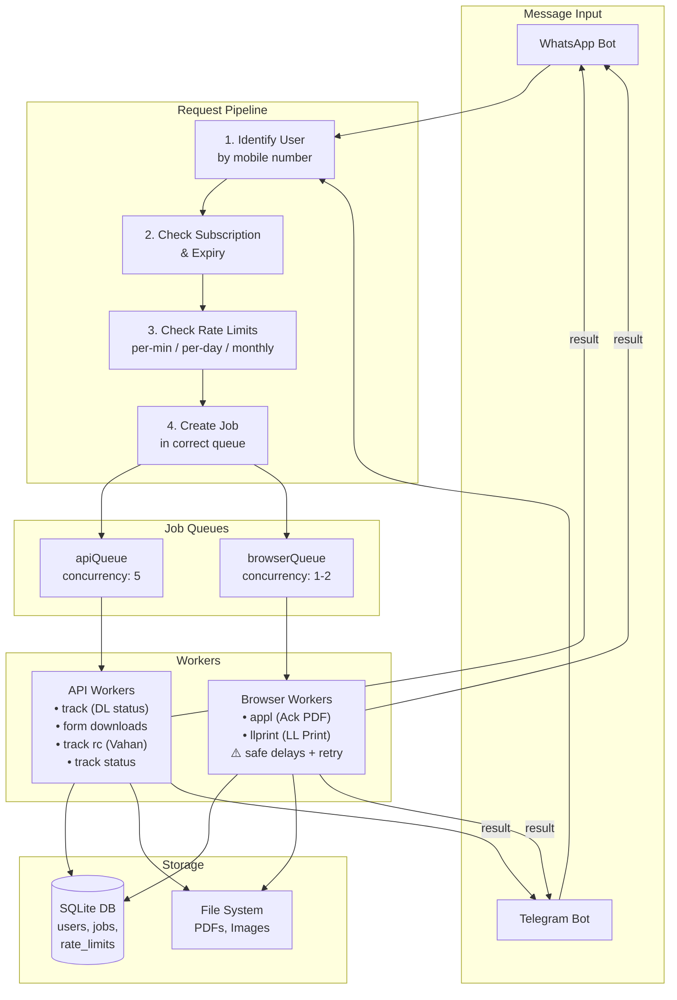

# Scale Sarathi Bot to 50 Users

Scale the bot from a small-user setup to a production-ready multi-user platform with proper user management, subscription enforcement, rate limiting, and a job queue + worker system to prevent IP bans and resource exhaustion.

## Current Architecture Summary

| Layer | Current State | Problem |
|---|---|---|
| **Auth** | Flat allow/deny via SQLite `auth_users` table | No subscription, quota, or expiry fields |
| **DB access** | `authorizationRepository.js` spawns a **child process** for every SQL query via `execSync` | Extremely slow; will bottleneck at scale |
| **Processing** | Every command is processed **inline** (synchronous) inside the message handler | No concurrency control; 2 users requesting `llprint` simultaneously = 2 Firefox instances |
| **Browser resources** | Puppeteer singleton (shared) + Playwright spawns a **new persistent context per request** | No concurrency limits; risk of IP ban and OOM |
| **Rate limiting** | None | A single user can spam unlimited requests |

## User Review Required

> [!IMPORTANT]
> **Database migration**: The existing `auth_users` table will be extended with new columns (name, subscription_plan, monthly_limit, used_count, expiry_date, billing_cycle_start). Existing users will be migrated with a default `free` plan and generous limits so nothing breaks.

> [!WARNING]
> **Breaking change to DB layer**: The current `authorizationRepository.js` uses `execSync` to spawn child processes for every SQL query. This is a critical bottleneck that must be replaced with an **in-process async SQLite connection** using `better-sqlite3` (synchronous but in-process) or the existing `sqlite3` package (async). The plan uses the already-installed `sqlite3` package to avoid new dependencies.

> [!IMPORTANT]
> **Job queue is in-memory**: Using `BullMQ` or `Redis` would be ideal for production but requires Redis infrastructure. This plan uses a lightweight **in-memory queue** with SQLite persistence for job status, to keep deployment simple (no Redis needed). If you want Redis-backed queues instead, let me know.

## Open Questions

> [!IMPORTANT]
> 1. **Subscription plans**: What plans do you want initially? The plan assumes `free` (default, limited) and `premium`. Should I add more tiers now?
> 2. **Default limits**: Proposed defaults — `free`: 50 requests/month, 5/minute, 100/day. `premium`: 500 requests/month, 15/minute, 300/day. Are these reasonable?
> 3. **Admin interface**: Currently admins manage users via WhatsApp chat commands (`auth add user ...`). Should we keep extending that pattern, or do you want an HTTP API / web dashboard later?
> 4. **What happens when a user is blocked?** Should blocked users get a "your subscription expired" message, or be silently ignored?
> 5. **llPrintService interactive flow**: The LL print flow is uniquely interactive (request → OTP → submit). This doesn't fit a simple fire-and-forget queue. The plan handles it as a special case. Is that acceptable?

---

## Proposed Changes

The implementation is split into **5 phases**, each independently testable.

---

### Phase 1: Database Refactor & User Management

Replace the child-process-per-query pattern with an in-process DB connection and extend the schema for subscriptions/quotas.

#### [MODIFY] [authzHelper.js](file:///c:/codex/Antigravity/sarathi_wabot_lastest/src/services/authzHelper.js)

Add new columns to `auth_users` table via migration:

```sql
-- New columns on auth_users
ALTER TABLE auth_users ADD COLUMN name TEXT DEFAULT '';
ALTER TABLE auth_users ADD COLUMN subscription_plan TEXT DEFAULT 'free';
ALTER TABLE auth_users ADD COLUMN monthly_limit INTEGER DEFAULT 50;
ALTER TABLE auth_users ADD COLUMN used_count INTEGER DEFAULT 0;
ALTER TABLE auth_users ADD COLUMN daily_count INTEGER DEFAULT 0;
ALTER TABLE auth_users ADD COLUMN expiry_date TEXT DEFAULT '';
ALTER TABLE auth_users ADD COLUMN billing_cycle_start TEXT DEFAULT '';
ALTER TABLE auth_users ADD COLUMN last_daily_reset TEXT DEFAULT '';
```

Add new `jobs` table:

```sql
CREATE TABLE IF NOT EXISTS jobs (
  id TEXT PRIMARY KEY,
  user_id TEXT NOT NULL,
  user_phone TEXT NOT NULL,
  queue_type TEXT NOT NULL,        -- 'api' or 'browser'
  command TEXT NOT NULL,            -- 'track', 'form1', 'llprint', etc.
  payload_json TEXT DEFAULT '{}',
  status TEXT DEFAULT 'pending',   -- pending, running, completed, failed
  result_json TEXT DEFAULT '{}',
  error_text TEXT DEFAULT '',
  chat_id TEXT NOT NULL,
  transport TEXT DEFAULT 'whatsapp',
  priority INTEGER DEFAULT 0,
  created_at TEXT NOT NULL,
  started_at TEXT DEFAULT '',
  completed_at TEXT DEFAULT '',
  FOREIGN KEY (user_id) REFERENCES auth_users(id)
);

CREATE INDEX IF NOT EXISTS idx_jobs_status ON jobs(status);
CREATE INDEX IF NOT EXISTS idx_jobs_user ON jobs(user_id, status);
CREATE INDEX IF NOT EXISTS idx_jobs_queue ON jobs(queue_type, status);
```

Add new `rate_limit_log` table:

```sql
CREATE TABLE IF NOT EXISTS rate_limit_log (
  id INTEGER PRIMARY KEY AUTOINCREMENT,
  user_id TEXT NOT NULL,
  timestamp TEXT NOT NULL,
  command TEXT NOT NULL
);

CREATE INDEX IF NOT EXISTS idx_rate_log_user ON rate_limit_log(user_id, timestamp);
```

#### [NEW] [db.js](file:///c:/codex/Antigravity/sarathi_wabot_lastest/src/core/db.js)

Central in-process database connection. Replaces the `execSync` child-process pattern:

```js
// Wraps sqlite3 with promise-based query/run helpers
// Single shared connection, WAL mode for concurrent reads
// Exports: getDb(), query(sql, params), run(sql, params), close()
```

#### [MODIFY] [authorizationRepository.js](file:///c:/codex/Antigravity/sarathi_wabot_lastest/src/services/authorizationRepository.js)

- Replace all `execSync` / child-process calls with imports from `db.js`
- `querySync()` → `await query()` (functions become async)
- `runSync()` → `await run()`
- Add new functions: `updateUserProfile()`, `getUserById()`, `resetMonthlyUsage()`, `incrementUsage()`, `resetDailyCount()`, `incrementDailyCount()`, `listAllUsers()`

#### [MODIFY] [authorizationService.js](file:///c:/codex/Antigravity/sarathi_wabot_lastest/src/services/authorizationService.js)

- All functions become async (since repo is now async)
- Add `getUserForRequest(message)` — resolves mobile → user record
- Add `isUserAllowed(user)` — checks `is_active`, `expiry_date`, subscription validity
- Update `addAuthorizedEntry` to accept name, plan, limits
- Add `editUser(phone, updates)`, `deleteUser(phone)`, `listUsers()`

#### [MODIFY] [authAdmin.js](file:///c:/codex/Antigravity/sarathi_wabot_lastest/src/commands/authAdmin.js)

Extend admin commands:

```
auth add user <phone> <name> [plan] [monthly_limit] [expiry]
auth edit user <phone> name=<name> plan=<plan> limit=<N> expiry=<date>
auth delete user <phone>
auth list users
auth user <phone>          -- show user details + usage
auth reset usage <phone>   -- manually reset monthly count
```

---

### Phase 2: Rate Limiting

#### [NEW] [rateLimiter.js](file:///c:/codex/Antigravity/sarathi_wabot_lastest/src/core/rateLimiter.js)

In-memory rate limiter with sliding window, backed by the `rate_limit_log` table for persistence across restarts:

```js
module.exports = {
  /**
   * Check all rate limits for a user. Returns { allowed, reason } 
   */
  checkRateLimit(userId, userPlan),
  
  /**
   * Record a request for rate-limit tracking
   */
  recordRequest(userId, command),
  
  /**
   * Get active job count for a user
   */
  getActiveJobCount(userId),
}
```

Rate limit tiers (configurable via config):

| Check | Free | Premium |
|---|---|---|
| Per minute | 5 | 15 |
| Per day | 100 | 300 |
| Per month | 50 | 500 |
| Max concurrent jobs | 2 | 5 |

#### [MODIFY] [config.js](file:///c:/codex/Antigravity/sarathi_wabot_lastest/src/config/config.js)

Add `RATE_LIMITS` section to CONFIG:

```js
RATE_LIMITS: {
  free: { perMinute: 5, perDay: 100, perMonth: 50, maxConcurrent: 2 },
  premium: { perMinute: 15, perDay: 300, perMonth: 500, maxConcurrent: 5 },
},
QUEUE: {
  API_CONCURRENCY: 5,
  BROWSER_CONCURRENCY: 1,
  BROWSER_DELAY_MS: 3000,
  BROWSER_MAX_RETRIES: 2,
},
```

---

### Phase 3: Job Queue System

#### [NEW] [jobQueue.js](file:///c:/codex/Antigravity/sarathi_wabot_lastest/src/core/jobQueue.js)

Dual in-memory queue with SQLite job persistence:

```js
class JobQueue {
  constructor(name, concurrency, options = {}) { ... }
  
  enqueue(job) { ... }         // Add job to queue, save to DB as 'pending'
  process(handler) { ... }     // Register worker handler
  getJob(jobId) { ... }        // Get job status
  getQueueStats() { ... }      // { pending, running, completed, failed }
}

// Two queue instances:
const apiQueue = new JobQueue('api', 5);           // 5 concurrent API workers
const browserQueue = new JobQueue('browser', 1, {  // 1 concurrent browser worker
  delayBetweenJobs: 3000,       // 3s between browser jobs
  maxRetries: 2,
  backoffMs: 5000,
});

module.exports = { apiQueue, browserQueue, JobQueue };
```

#### [NEW] [jobRepository.js](file:///c:/codex/Antigravity/sarathi_wabot_lastest/src/services/jobRepository.js)

CRUD operations for the `jobs` table:

```js
module.exports = {
  createJob(job),
  updateJobStatus(jobId, status, result, error),
  getJobById(jobId),
  getActiveJobsForUser(userId),
  getPendingJobs(queueType),
  getJobStats(),
  cleanupOldJobs(olderThanDays),
}
```

---

### Phase 4: Worker System

#### [NEW] [apiWorker.js](file:///c:/codex/Antigravity/sarathi_wabot_lastest/src/workers/apiWorker.js)

Processes `apiQueue` jobs. Handles:
- `track` → statusService.getStatusSnapshot()
- `form1`, `form1a`, `form2` → formService.downloadForm()
- `formset` → formsetService
- `track_rc` → vahanService.startLookup()
- `add_track`, `remove_track`, `list_track`, etc.

```js
apiQueue.process(async (job) => {
  switch (job.command) {
    case 'track': return await handleTrackJob(job);
    case 'form1': return await handleFormJob(job, 'form1');
    // ...
  }
});
```

#### [NEW] [browserWorker.js](file:///c:/codex/Antigravity/sarathi_wabot_lastest/src/workers/browserWorker.js)

Processes `browserQueue` jobs with strict concurrency control. Handles:
- `appl` → ackService.getAckPDF() / getAckImage()
- `llprint_start` → llPrintService.startLLPrintFlow()

```js
browserQueue.process(async (job) => {
  // Add safe delay before each browser job
  await sleep(CONFIG.QUEUE.BROWSER_DELAY_MS);
  
  switch (job.command) {
    case 'appl': return await handleApplJob(job);
    case 'llprint_start': return await handleLLPrintJob(job);
  }
});
```

> [!NOTE]
> The `llprint` flow is interactive (needs OTP input). It will be handled as a **two-phase job**: Phase 1 creates the browser context and triggers OTP (browser queue). Phase 2 (OTP submission) runs inline since the context is already open and waiting.

#### [NEW] [workers/index.js](file:///c:/codex/Antigravity/sarathi_wabot_lastest/src/workers/index.js)

Worker bootstrap — registers both workers, handles graceful shutdown.

---

### Phase 5: Request Pipeline Integration

#### [NEW] [requestPipeline.js](file:///c:/codex/Antigravity/sarathi_wabot_lastest/src/core/requestPipeline.js)

Central middleware that every incoming message passes through:

```js
async function processRequest(message, transport, commandInfo) {
  // 1. Identify user by mobile number
  const user = await identifyUser(message, transport);
  if (!user) return { blocked: true, reason: 'unregistered' };
  
  // 2. Check subscription & expiry
  if (!isSubscriptionValid(user)) return { blocked: true, reason: 'expired' };
  
  // 3. Check active status
  if (!user.is_active) return { blocked: true, reason: 'inactive' };
  
  // 4. Check rate limits (per-minute, per-day, monthly quota)
  const rateCheck = await checkRateLimit(user.id, user.subscription_plan);
  if (!rateCheck.allowed) return { blocked: true, reason: rateCheck.reason };
  
  // 5. Check max concurrent jobs
  const activeJobs = await getActiveJobCount(user.id);
  const limits = CONFIG.RATE_LIMITS[user.subscription_plan];
  if (activeJobs >= limits.maxConcurrent) return { blocked: true, reason: 'too_many_active_jobs' };
  
  // 6. Create job in correct queue
  const queueType = getQueueType(commandInfo.command);
  const job = await createJob({
    userId: user.id,
    userPhone: user.canonical_phone,
    queueType,
    command: commandInfo.command,
    payload: commandInfo.payload,
    chatId: commandInfo.chatId,
    transport,
  });
  
  // 7. Increment usage counters
  await incrementUsage(user.id);
  await recordRequest(user.id, commandInfo.command);
  
  return { blocked: false, job };
}
```

**Queue type classification:**

| Command | Queue | Reason |
|---|---|---|
| `track` (DL status) | `apiQueue` | HTTP fetch + Puppeteer render (lightweight) |
| `form1`, `form1a`, `form2`, `formset` | `apiQueue` | Pure HTTP download |
| `track rc` (Vahan) | `apiQueue` | HTTP + captcha model (CPU, not browser) |
| `add track`, `remove track`, `list track`, `refresh track` | `apiQueue` | Lightweight DB + HTTP |
| `track status` | `apiQueue` | HTTP + image render |
| `appl` (Ack PDF) | `browserQueue` | Full Puppeteer browser navigation |
| `llprint` | `browserQueue` | Full Playwright Firefox session |

#### [MODIFY] [bot.js](file:///c:/codex/Antigravity/sarathi_wabot_lastest/src/bot.js)

Major refactor of `handleMessage()`:

- **Before**: Giant 840-line function that does auth check → parse command → call service → reply
- **After**: Thin routing layer that does: parse command → call `requestPipeline.processRequest()` → if allowed, enqueue job → send "Processing..." acknowledgment

The bot no longer calls service functions directly. Instead:
1. Parse the command and payload
2. Pass through the request pipeline (user identification → validation → rate limit → enqueue)
3. Workers process the job and send the result back to the user via `chatNotifier`

**Exceptions** (remain inline, not queued):
- `alive` / `suno` — trivial, no external calls
- `help` — trivial
- `send_chatid` — trivial
- `auth` admin commands — admin-only, low volume
- OTP submission for `llprint` — interactive, context already open

#### [MODIFY] [telegramBot.js](file:///c:/codex/Antigravity/sarathi_wabot_lastest/src/telegramBot.js)

Same refactor pattern as `bot.js` — route through `requestPipeline` instead of calling services directly.

#### [NEW] [billingCron.js](file:///c:/codex/Antigravity/sarathi_wabot_lastest/src/services/billingCron.js)

Scheduled tasks:
- **Daily at midnight**: Reset `daily_count` for all users
- **Monthly**: Reset `used_count` when `billing_cycle_start` anniversary is reached
- **Cleanup**: Purge completed/failed jobs older than 30 days

#### [MODIFY] [server.js](file:///c:/codex/Antigravity/sarathi_wabot_lastest/server.js)

- Import and start workers (`apiWorker`, `browserWorker`)
- Start billing cron scheduler
- Add worker shutdown to `handleShutdown()`

---

## Architecture Diagram



---

## New File Tree

```
src/
├── core/
│   ├── auth.js              (modified - async)
│   ├── db.js                (NEW - central DB connection)
│   ├── httpClient.js
│   ├── jobQueue.js          (NEW - dual queue system)
│   ├── rateLimiter.js       (NEW - rate limit checks)
│   ├── requestPipeline.js   (NEW - central request middleware)
│   ├── puppeteerEngine.js
│   ├── runtimeCleanup.js
│   ├── sessionManager.js
│   └── tempFiles.js
├── workers/
│   ├── index.js             (NEW - worker bootstrap)
│   ├── apiWorker.js         (NEW - fast HTTP job processor)
│   └── browserWorker.js     (NEW - heavy browser job processor)
├── services/
│   ├── authorizationRepository.js  (modified - use db.js)
│   ├── authorizationService.js     (modified - async + user mgmt)
│   ├── billingCron.js              (NEW - usage reset scheduler)
│   ├── jobRepository.js            (NEW - job CRUD)
│   └── ... (existing services unchanged)
├── commands/
│   ├── authAdmin.js         (modified - extended commands)
│   └── ... (existing commands unchanged)
├── bot.js                   (modified - thin routing layer)
├── telegramBot.js           (modified - thin routing layer)
└── config/
    └── config.js            (modified - rate limit + queue config)
```

---

## Verification Plan

### Automated Tests

1. **DB migration test**: Run the app, verify new columns exist in `auth_users`, new tables `jobs` and `rate_limit_log` are created
2. **User management test**: Via WhatsApp admin commands, add/edit/delete users and verify DB state
3. **Rate limit test**: Script that sends rapid requests and verifies blocking after limit
4. **Job queue test**: Submit multiple jobs, verify they are queued and processed in order with correct concurrency
5. **Expired user test**: Set a user's expiry to the past, verify requests are blocked

```bash
# Run the bot and test via WhatsApp
npm start

# Verify DB schema
node -e "const db = require('./src/core/db'); db.query('PRAGMA table_info(auth_users)').then(console.log)"

# Verify job table
node -e "const db = require('./src/core/db'); db.query('SELECT * FROM jobs LIMIT 5').then(console.log)"
```

### Manual Verification

1. **Multi-user concurrency**: Have 2-3 test users send requests simultaneously → verify jobs are queued, not all processed at once
2. **Browser concurrency**: Send 3 `appl` requests → verify only 1 runs at a time, others queue
3. **Rate limit UX**: Spam requests from one user → verify they get a "rate limited" message
4. **Expired user UX**: Set expiry to yesterday → verify user gets blocked message
5. **Admin commands**: Test all new `auth` subcommands work correctly
6. **Billing reset**: Fast-forward billing cycle → verify `used_count` resets
